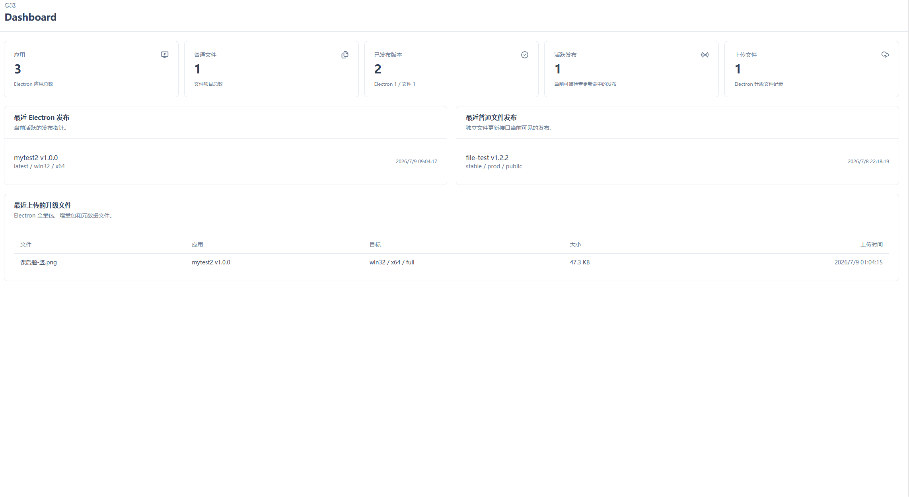
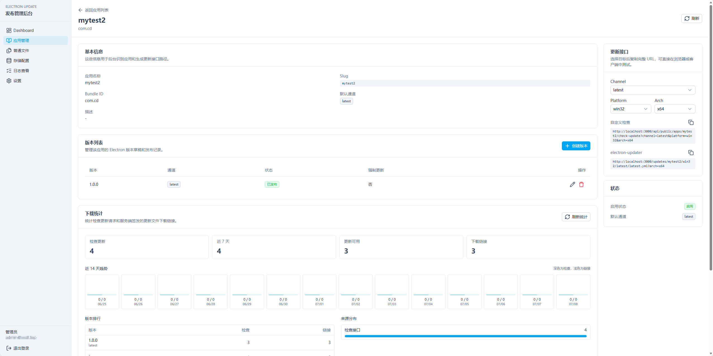
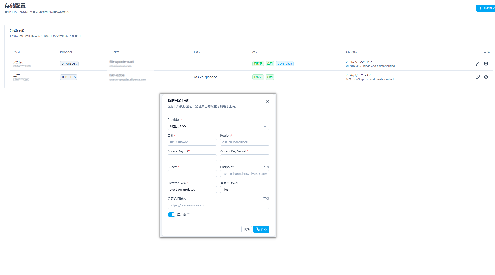
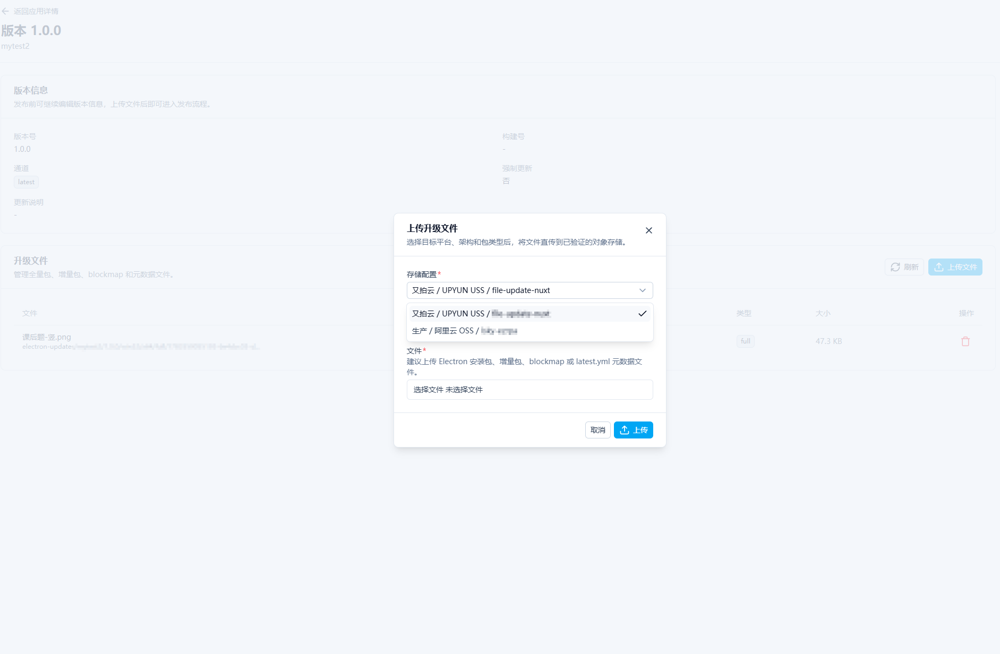
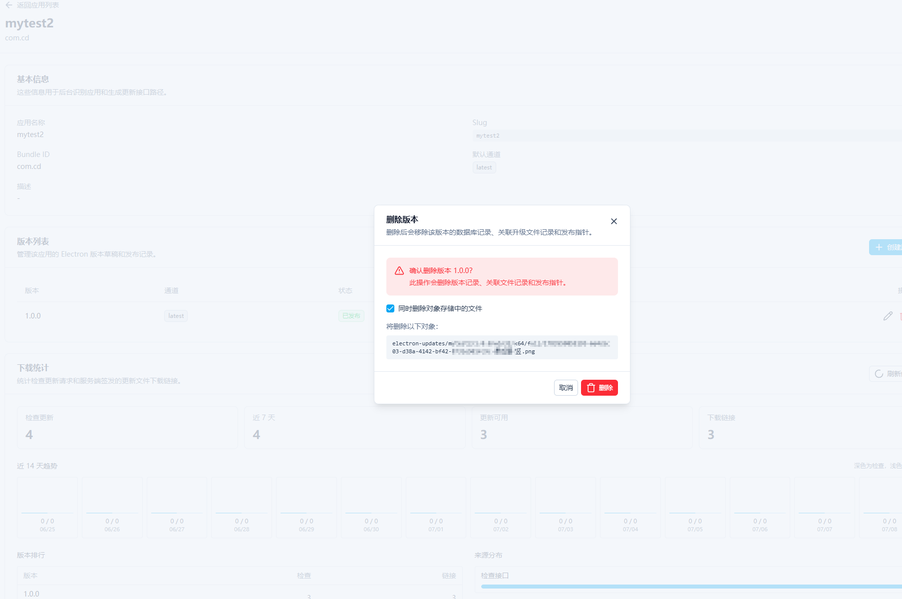

# File Update Nuxt

一个基于 Nuxt、Nuxt UI、Drizzle ORM 和 SQLite/libSQL 的文件更新发布平台。项目支持 Electron 应用更新、普通文件版本发布、对象存储直传、下载统计、更新检查统计、审计日志和 CI/CD 自动发布。

English README is available below.

## 中文说明

### 技术栈

- Nuxt 4
- Nuxt UI 4
- Drizzle ORM
- SQLite/libSQL
- nuxt-auth-utils
- 对象存储：阿里云 OSS、腾讯云 COS、七牛 Kodo、AWS S3、又拍云 USS

### 环境要求

- Node.js 20+
- pnpm
- SQLite/libSQL 可用的本地文件数据库，默认路径为 `./data/app.db`

### 安装依赖

```bash
pnpm install
```

### 环境变量

复制环境变量模板：

```bash
cp .env.example .env
```

核心配置：

```env
# 会话加密密钥，生产环境请填写至少 32 位随机字符串
NUXT_SESSION_PASSWORD=

# SQLite/libSQL 数据库地址，默认使用本地 data/app.db
DATABASE_URL=file:./data/app.db

# 签名下载链接有效期，单位秒
DOWNLOAD_URL_EXPIRES_SECONDS=600

# Electron 应用公开更新检查接口是否要求 token
UPDATE_TOKEN_REQUIRED=false

# 普通文件公开更新/下载接口是否要求 token
FILE_UPDATE_TOKEN_REQUIRED=false

# CI/CD API 明文 token，适合本地开发
CI_API_TOKEN=

# CI/CD API token 的 SHA-256 hex 摘要，生产环境推荐使用这个
CI_API_TOKEN_SHA256=
```

说明：

- 对象存储配置不再通过 `.env` 配置，请在后台的“对象存储配置”页面新增并验证。
- 管理员账号不再通过 `.env` 自动创建，请通过 `/setup` 页面或 `/api/setup/admin` 接口手动初始化。
- `CI_API_TOKEN_SHA256` 是推荐的生产配置，值为 CI Token 的 SHA-256 hex 摘要；本地开发可以直接使用 `CI_API_TOKEN`。

### 数据库生成步骤

推荐使用 Drizzle 迁移初始化数据库：

```bash
pnpm db:generate
pnpm db:migrate
```

命令说明：

- `pnpm db:generate`：根据 [db/schema.ts](db/schema.ts) 生成迁移文件。
- `pnpm db:migrate`：根据 `DATABASE_URL` 将 [db/migrations](db/migrations) 中的迁移应用到数据库。

如果只是从空库快速初始化，也可以使用完整 SQL：

```bash
sqlite3 ./data/app.db < docs/database.sql
```

完整建表 SQL 位于 [docs/database.sql](docs/database.sql)。

### 管理员初始化步骤

启动项目后访问：

```text
http://localhost:3000/setup
```

也可以直接调用接口：

```bash
curl -X POST "http://localhost:3000/api/setup/admin" \
  -H "Content-Type: application/json" \
  -d '{
    "email": "admin@example.com",
    "password": "your-password-at-least-8-chars",
    "name": "Administrator"
  }'
```

注意：

- 密码至少 8 位。
- 只允许在没有任何用户时初始化管理员。
- 初始化完成后，通过 `/login` 登录后台。

### 开发和构建

开发启动：

```bash
pnpm dev
```

生产构建：

```bash
pnpm build
```

本地预览生产产物：

```bash
pnpm preview
```

### Docker 构建和运行

构建镜像：

```bash
docker build -t file-update-nuxt:latest .
```

运行容器：

```bash
docker run -d \
  --name file-update-nuxt \
  -p 3000:3000 \
  -v file-update-data:/app/data \
  -e NUXT_SESSION_PASSWORD=your-random-session-secret-at-least-32-chars \
  file-update-nuxt:latest
```

容器默认配置：

- 服务端口：`3000`
- 数据库地址：`file:/app/data/app.db`
- 数据持久化目录：`/app/data`
- 启动时自动执行数据库迁移：`RUN_DB_MIGRATIONS=true`
- Node 服务由 `pm2-runtime` 启动和托管

如果你想手动管理数据库迁移，可以在运行容器时设置：

```bash
-e RUN_DB_MIGRATIONS=false
```

### 项目功能介绍

- 仪表盘：展示应用、版本、文件项目、下载量和更新检查等汇总数据。
- Electron 应用管理：创建应用、维护版本、上传更新包、发布、回滚、撤销发布。
- Electron 更新接口：支持 `latest.yml`、`latest-mac.yml`、`latest-linux.yml` 以及公开更新检查 API。
- 普通文件管理：创建文件项目、维护文件版本、发布、回滚、撤销发布。
- 普通文件公开访问：支持分享页、最新版本查询、下载接口和更新检查接口。
- 对象存储配置：支持多套存储配置、可用性校验、签名上传和签名下载。
- 下载统计：记录 Electron 更新包下载、普通文件下载、普通文件更新检查和 Electron 更新检查。
- CI/CD 自动发布：CI 可以调用 `/api/ci/*` 接口完成上传地址申请、对象存储直传、元数据登记和自动发布。详细文档见 [docs/ci-cd-api.md](docs/ci-cd-api.md)。
- 审计日志：记录后台操作和 CI 发布操作，便于追踪问题。
- 权限和会话：后台接口需要管理员登录，会话由 `nuxt-auth-utils` 管理。

### 界面截图

#### 仪表盘



#### Electron 应用详情



#### 新增对象存储配置



#### 上传版本文件



#### 删除版本



### 目录说明

```text
app/          Nuxt 前端页面、布局和样式
server/api/   Nitro API 路由
server/utils/ 服务端工具函数和业务逻辑
server/routes Electron updater 兼容路由
db/           Drizzle schema 和迁移文件
docs/         API 文档、数据库 SQL 和图片资料
data/         默认 SQLite 数据库目录
```

## English

### Overview

File Update Nuxt is a release management platform built with Nuxt, Nuxt UI, Drizzle ORM, and SQLite/libSQL. It supports Electron auto updates, ordinary file releases, direct object-storage uploads, download analytics, update-check analytics, audit logs, and CI/CD automation.

### Tech Stack

- Nuxt 4
- Nuxt UI 4
- Drizzle ORM
- SQLite/libSQL
- nuxt-auth-utils
- Object storage providers: Aliyun OSS, Tencent COS, Qiniu Kodo, AWS S3, UPYUN USS

### Requirements

- Node.js 20+
- pnpm
- SQLite/libSQL file database. The default database path is `./data/app.db`.

### Install Dependencies

```bash
pnpm install
```

### Environment Variables

Copy the example environment file:

```bash
cp .env.example .env
```

Main configuration:

```env
# Session encryption secret. Use at least 32 random characters in production.
NUXT_SESSION_PASSWORD=

# SQLite/libSQL database URL. The default local database is data/app.db.
DATABASE_URL=file:./data/app.db

# Signed download URL lifetime in seconds.
DOWNLOAD_URL_EXPIRES_SECONDS=600

# Require token for public Electron update-check APIs.
UPDATE_TOKEN_REQUIRED=false

# Require token for public ordinary-file update/download APIs.
FILE_UPDATE_TOKEN_REQUIRED=false

# Plain CI/CD API token, useful for local development.
CI_API_TOKEN=

# SHA-256 hex digest of the CI/CD API token. Recommended for production.
CI_API_TOKEN_SHA256=
```

Notes:

- Object storage is not configured through `.env`; add and verify storage profiles in the admin UI.
- The administrator account is not created from `.env`; initialize it manually through `/setup` or `/api/setup/admin`.
- `CI_API_TOKEN_SHA256` is recommended for production. It should be the SHA-256 hex digest of the CI token. `CI_API_TOKEN` is convenient for local development.

### Database Generation

The recommended way is to use Drizzle migrations:

```bash
pnpm db:generate
pnpm db:migrate
```

Command details:

- `pnpm db:generate`: generates migration files from [db/schema.ts](db/schema.ts).
- `pnpm db:migrate`: applies migrations from [db/migrations](db/migrations) to the database configured by `DATABASE_URL`.

For a fresh database, you can also use the complete SQL script:

```bash
sqlite3 ./data/app.db < docs/database.sql
```

The complete schema SQL is available at [docs/database.sql](docs/database.sql).

### Administrator Initialization

After starting the app, open:

```text
http://localhost:3000/setup
```

Or call the setup API:

```bash
curl -X POST "http://localhost:3000/api/setup/admin" \
  -H "Content-Type: application/json" \
  -d '{
    "email": "admin@example.com",
    "password": "your-password-at-least-8-chars",
    "name": "Administrator"
  }'
```

Notes:

- The password must contain at least 8 characters.
- Administrator setup is only allowed when the database has no users.
- After setup, sign in from `/login`.

### Development and Build

Start the development server:

```bash
pnpm dev
```

Build for production:

```bash
pnpm build
```

Preview the production build locally:

```bash
pnpm preview
```

### Docker Build and Run

Build the image:

```bash
docker build -t file-update-nuxt:latest .
```

Run the container:

```bash
docker run -d \
  --name file-update-nuxt \
  -p 3000:3000 \
  -v file-update-data:/app/data \
  -e NUXT_SESSION_PASSWORD=your-random-session-secret-at-least-32-chars \
  file-update-nuxt:latest
```

Container defaults:

- Server port: `3000`
- Database URL: `file:/app/data/app.db`
- Persistent data directory: `/app/data`
- Run database migrations on startup: `RUN_DB_MIGRATIONS=true`
- The Node server is started and managed by `pm2-runtime`

If you want to manage database migrations manually, set:

```bash
-e RUN_DB_MIGRATIONS=false
```

### Features

- Dashboard: app, version, file project, download, and update-check summaries.
- Electron app management: create apps, manage versions, upload update artifacts, publish, roll back, and revoke releases.
- Electron update APIs: supports `latest.yml`, `latest-mac.yml`, `latest-linux.yml`, and public update-check endpoints.
- Ordinary file management: create file projects, manage file versions, publish, roll back, and revoke releases.
- Public file access: share page, latest-version API, download API, and update-check API.
- Object storage configuration: multiple storage profiles, verification, signed uploads, and signed downloads.
- Download analytics: tracks Electron package downloads, ordinary file downloads, file update checks, and Electron update checks.
- CI/CD automation: CI can call `/api/ci/*` endpoints to request upload URLs, upload directly to object storage, register metadata, and publish automatically. See [docs/ci-cd-api.md](docs/ci-cd-api.md).
- Audit logs: tracks admin operations and CI release operations.
- Authentication and sessions: admin APIs require login; sessions are handled by `nuxt-auth-utils`.

### Screenshots

#### Dashboard


#### Electron App Details


#### Add Storage Configuration


#### Upload Version Files


#### Delete Version


### Project Structure

```text
app/          Nuxt frontend pages, layouts, and styles
server/api/   Nitro API routes
server/utils/ Server utilities and business logic
server/routes Electron updater compatible routes
db/           Drizzle schema and migrations
docs/         API docs, database SQL, and images
data/         Default SQLite database directory
```
