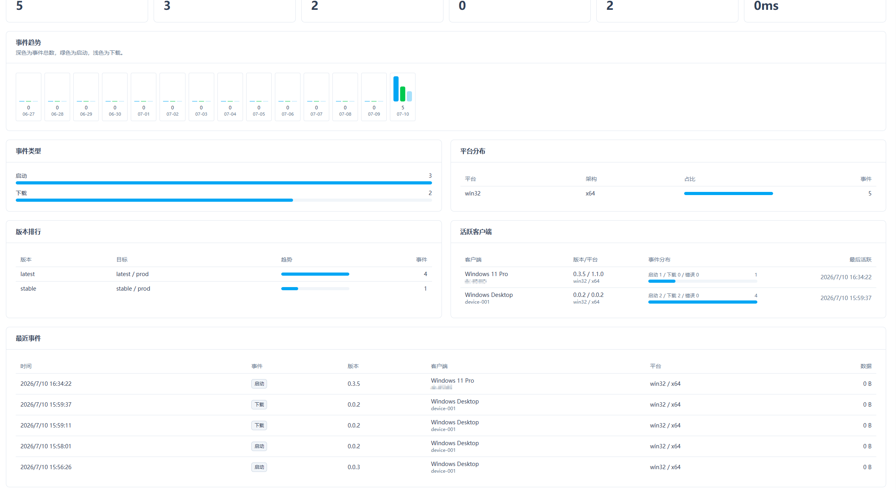

# File Update Nuxt

一个基于 Nuxt、Nuxt UI、Drizzle ORM 和 SQLite/libSQL 的文件更新发布平台，面向 Electron 应用自动更新、普通文件版本发布、对象存储直传、下载/客户端事件统计和 CI/CD 自动发布。

English version: [README.en.md](README.en.md)

## 功能概览

- Dashboard：展示应用、版本、普通文件项目、活跃发布、更新检查、下载和客户端上报概览。
- Electron 应用管理：创建应用、维护版本、上传更新包、发布、回滚、撤销发布。
- Electron 更新接口：支持 `latest.yml`、`latest-mac.yml`、`latest-linux.yml` 和公开检查更新 API。
- 普通文件发布：创建文件项目、维护文件版本、分享页、最新版本查询、下载接口和检查更新接口。
- 对象存储：支持多套存储配置、直传上传、签名下载、公开 CDN 域名和防盗链。
- 数据统计：支持下载统计、检查更新统计、客户端事件上报、平台/版本/活跃客户端分析。
- CI/CD 自动发布：支持 CI 调用 `/api/ci/*` 完成上传地址申请、对象存储直传、元数据登记和自动发布。
- 审计日志：记录后台操作和 CI 发布操作。
- 管理员会话：后台接口需要登录，使用 `nuxt-auth-utils` 管理会话。

## 存储支持

当前已实际测试：

- 阿里云 OSS
- 又拍云 USS

设计上还支持：

- 腾讯云 COS
- 七牛 Kodo
- AWS S3

存储能力：

- 对象存储直传上传
- 签名上传 URL
- 签名下载 URL
- 公开访问域名
- 又拍云 CDN Token 防盗链：仅在又拍云 CDN 开启防盗链时填写密钥；未开启时留空即可
- 存储配置验证：上传测试对象并验证可访问性

## 技术栈

- Nuxt 4
- Nuxt UI 4
- Drizzle ORM
- SQLite/libSQL
- nuxt-auth-utils
- PM2 / Docker 部署支持

## 环境要求

- Node.js 20+
- pnpm
- SQLite/libSQL 文件数据库，默认路径为 `./data/app.db`

## 安装依赖

```bash
pnpm install
```

## 环境变量

复制环境变量模板：

```bash
cp .env.example .env
```

核心配置：

```env
# 会话加密密钥，生产环境请填写至少 32 位随机字符串
NUXT_SESSION_PASSWORD=

# SQLite/libSQL 数据库地址，默认使用本地 data/app.db
DATABASE_URL=file:./data/app.db

# 签名下载链接有效期，单位秒
DOWNLOAD_URL_EXPIRES_SECONDS=600

# Electron 应用公开更新检查接口是否要求 token
UPDATE_TOKEN_REQUIRED=false

# 普通文件公开更新/下载接口是否要求 token
FILE_UPDATE_TOKEN_REQUIRED=false

# CI/CD API 明文 token，适合本地开发
CI_API_TOKEN=

# CI/CD API token 的 SHA-256 hex 摘要，生产环境推荐使用
CI_API_TOKEN_SHA256=
```

说明：

- 对象存储配置不通过 `.env` 配置，请在后台“存储配置”页面新增并验证。
- 管理员账号不通过 `.env` 自动创建，请通过 `/setup` 页面或 `/api/setup/admin` 接口初始化。
- 生产环境推荐使用 `CI_API_TOKEN_SHA256`，值为 CI Token 的 SHA-256 hex 摘要；本地开发可直接使用 `CI_API_TOKEN`。

## 数据库生成步骤

推荐使用 Drizzle 迁移初始化数据库：

```bash
pnpm db:generate
pnpm db:migrate
```

命令说明：

- `pnpm db:generate`：根据 [db/schema.ts](db/schema.ts) 生成迁移文件。
- `pnpm db:migrate`：根据 `DATABASE_URL` 将 [db/migrations](db/migrations) 中的迁移应用到数据库。

如果是空库快速初始化，也可以直接使用完整 SQL：

```bash
sqlite3 ./data/app.db < docs/database.sql
```

完整建表 SQL 位于 [docs/database.sql](docs/database.sql)。

## 管理员初始化步骤

启动项目后访问：

```text
http://localhost:3000/setup
```

也可以直接调用接口：

```bash
curl -X POST "http://localhost:3000/api/setup/admin" \
  -H "Content-Type: application/json" \
  -d '{
    "email": "admin@example.com",
    "password": "your-password-at-least-8-chars",
    "name": "Administrator"
  }'
```

注意：

- 密码至少 8 位。
- 只允许在没有任何用户时初始化管理员。
- 初始化完成后，通过 `/login` 登录后台。

## 开发和构建

开发启动：

```bash
pnpm dev
```

生产构建：

```bash
pnpm build
```

本地预览生产产物：

```bash
pnpm preview
```

## Docker 构建和运行

构建镜像：

```bash
docker build -t file-update-nuxt:latest .
```

运行容器：

```bash
docker run -d \
  --name file-update-nuxt \
  -p 3000:3000 \
  -v file-update-data:/app/data \
  -e NUXT_SESSION_PASSWORD=your-random-session-secret-at-least-32-chars \
  file-update-nuxt:latest
```

容器默认配置：

- 服务端口：`3000`
- 数据库地址：`file:/app/data/app.db`
- 数据持久化目录：`/app/data`
- 启动时自动执行数据库迁移：`RUN_DB_MIGRATIONS=true`
- Node 服务使用 `pm2-runtime` 启动和托管

如果想手动管理数据库迁移，可以在运行容器时设置：

```bash
-e RUN_DB_MIGRATIONS=false
```

## CI/CD

CI/CD API 文档见 [docs/ci-cd-api.md](docs/ci-cd-api.md)。

客户端事件上报 API 文档见 [docs/client-events-api.md](docs/client-events-api.md)。

## 界面截图

### Dashboard


### 数据统计



### Electron 应用详情


### 新增对象存储配置


### 上传版本文件


### 删除版本


## 目录说明

```text
app/           Nuxt 前端页面、布局和样式
server/api/    Nitro API 路由
server/utils/  服务端工具函数和业务逻辑
server/routes/ Electron updater 兼容路由
db/            Drizzle schema 和迁移文件
docs/          API 文档、数据库 SQL 和截图资源
data/          默认 SQLite 数据库目录
```
